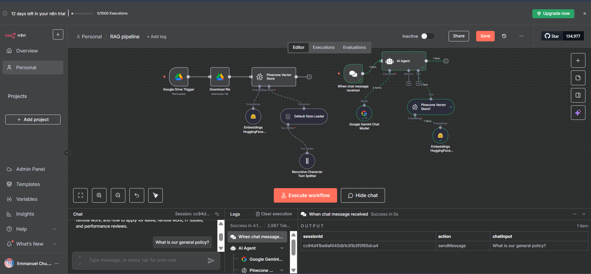

# RAG Pipeline with n8n 🚀

This repository contains my **Retrieval-Augmented Generation (RAG) pipeline** workflow built in [n8n](https://n8n.io/).

## 📂 Workflow Overview
- 📂 **Google Drive Trigger** → Watch for new documents
- 🧩 **Text Splitter** → Break documents into chunks
- 🔢 **HuggingFace Embeddings** → Convert chunks into vectors
- 📊 **Pinecone Vector Store** → Store & retrieve embeddings
- 💬 **Gemini Chat Model** → Generate responses with context
- 🤖 **AI Agent** → Orchestrates retrieval + generation

## 🖼️ Workflow Screenshot

## 📌 Usage
1. Import the workflow JSON into your n8n instance
2. Connect your own API keys for HuggingFace, Pinecone, and Gemini
3. Run the workflow 🎉

---
 Built with [n8n](https://n8n.io/) + [Pinecone](https://www.pinecone.io/)
